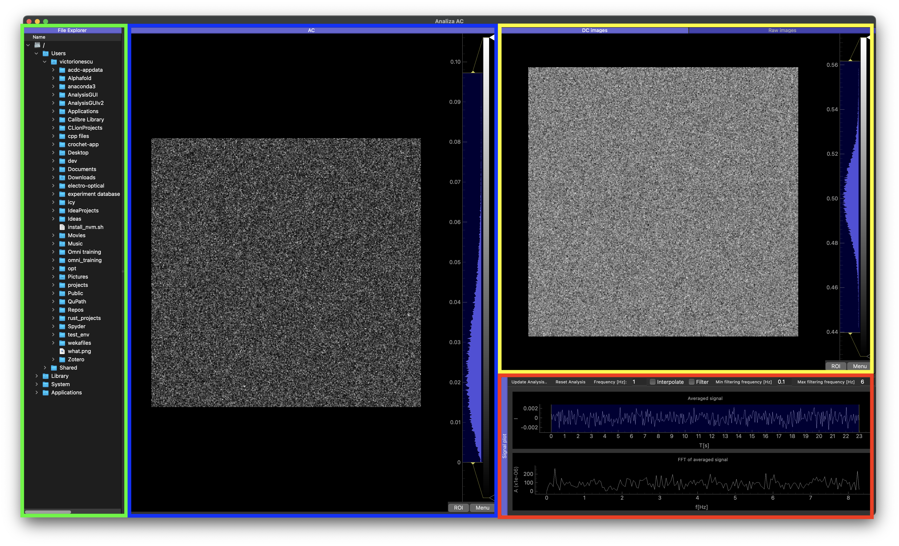
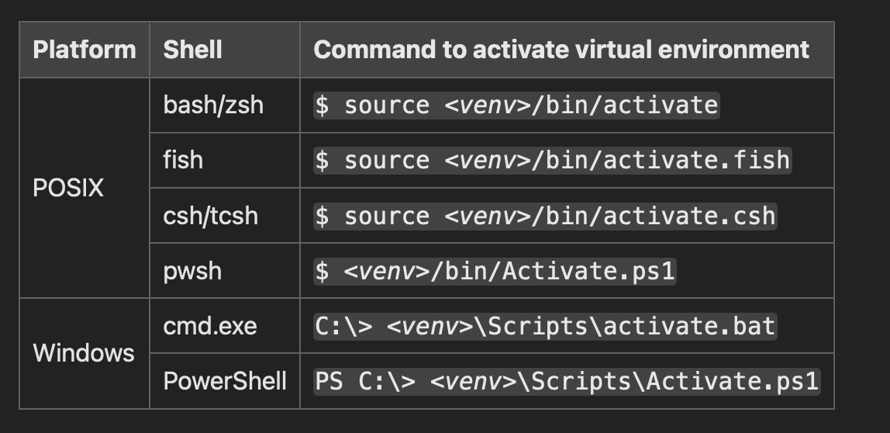

## Table of Contents

1. [Description and Features](#description-and-features)
    - [Brief Principle](#brief-principle)
    - [Function of the Program](#function-of-the-program)
        - [Signal Analysis](#signal-analysis)
        - [Segmentation](#segmentation)
        - [Tracking](#tracking)
        - [Single Cell Measurements](#single-cell-measurements)
2. [Installation](#installation)
3. [Quickstart](#quickstart)
4. [User Guide](#user-guide)
5. [Troubleshooting](#troubleshooting)
6. [Appendix](#appendix)
    - [Python virtual environments](#python-virtual-environments)
    - [Naming conventions](#naming-conventions)

# Description and Features

## Brief principle

This applet's main function is essentially to do Fourier Analysis of per-pixel signals in multiple 2D+T image stacks, find objects in the optical images, construct tracks for these objects, and finally produce a set of per-object time series, based on several observables. Currently, the program is geared towards single-cell analysis in electro-optical time series images.

## Function of the program

This app is currently aimed at providing a user interface for the processing and obtaining single-object measurements from electro-optical time series. Obtaining the data can be broken down into four important steps:

1. **Signal analysis**
2. **Cell segmentation**
3. **Cell tracking**
4. **Single cell measurements**

### Signal Analysis

In an electro-optical measurement stack, each spatial location has its associated time series, resulting from the AC signal applied during acquisition. The app uses signal processing methods to clean up the signal, Fourier transform it, and extract the **amplitude** of the desired frequency, the result being an "Amplitude image" to indicate where oscillations were strongest.

#### Signal Analysis Key Features

- **Parallel Signal Processing:** Efficiently processes large image stacks (~400 frames per measurement).
- **Amplitude Image:** Highlights regions with the strongest oscillations.
- **Signal Examination:** Signals from specific regions can be examined individually after analysis.

#### Workflow:

1. Apply signal processing methods.
2. Extract amplitude of the desired frequency.
3. Generate amplitude images for analysis.
4. Examine and modify signal processing results.

### Segmentation

Using a pre-existing model (Omnipose, cite here), tuned to DIC images when necessary, the program performs segmentations on the (time-averaged) image stack, obtaining cell masks with great accuracy, especially considering the quality of the images used; DIC microscopy doesn't show a great difference in intensity on objects in focus. The segmentation model is pre-trained with a large number of phase-contrast images, but adapting some of its parameters allows it to make decently accurate predictions on DIC images as well, provided the cells have some contrast from the background.

#### Key Features:

- **Fast, GPU-based segmentation:** Using PyTorch's backend selection, images can be processed quickly on most devices.
- **Editable segmentation masks:** In the dedicated segmentation panel, masks can be edited and modified using drawing tools or bulk operations (delete label x, change label y to brush color etc.).
- **(Coming soon) Hot-swapping between phase contrast/DIC:** To enable greater segmentation flexibility, a segmentation mode selector will be added for switching between DIC and pahse contrast images.

#### Workflow

1. Segment images of interest
2. Open Segmentation Editor
3. Check and correct masks

### Tracking

From the segmentation image series, (remember, multiple measurements over time), a tracking networ is constructed by evaluating similarities between cells, and considering biological aspects like mitosis. Currently, merges between masks are disallowed, as they are usually either a result of overlapping cells or loss of contrast in the source images. The tracking panel provides the user with a large number of tools for editing/correcting segmentation and tracking issues. These include but are not limited to:

#### Key Features:

- **Robust, automatic tracking:** Hybrid IoU/shape features tracker, with additional considerations for biology (cell mitosis). Provided the masks are assigned correctly, the tracker provides accurate lineage reconstruction with minimal human interference.
- **Editable segmentation masks:** Mirroring the segmentation panel, masks can be edited and modified using drawing tools or bulk operations (delete label x, change label y to brush color etc.). Filtering based on cell features is also available.
- **Editable cell lineages:** In the (hopefully) rare cases where the tracker does fail, lineage correction is possible via interacting with the lineage graph panel: linking/unlinking nodes, as well as removing entire lineage branches from the graph and images, is possible.
- **Image stabilization (experimental):** Image stabilization can be applied to the image data obtaine, using the masks as a guide. THIS WILL CHANGE THE IMAGE DATA PERMANENTLY!

#### Workflow:

1. Track segmentation masks automatically
2. Correct erroneous masks/links
3. Continue analyzing the data

####

Though not very sophisticated in GUI terms, the interface provided at this stage is functional and prevents the user from **severely** shooting themselves in the foot in most cases.

### Single cell measurements

Before this project was finalized, which observables were relevant to the cells' evolution were determined empirically, and those are now hard-coded into the app. Measurmenets are done algorithmically for each cell, in parallel for speed, and displayed to the user as a time series, where they can be easily compared to the others to study interesting dynamics.

#### Key Features:

- **Fast Per-Cell Feature Computation:** Using parallel processing, cells are analyzed in all image types by using the provided segmentation masks and obtained lineage graph.
- **Easy Cell Contour Visualisation:** In both AC (amplitude) and DC(time-averaged) images, the user can view the obtained cell contours and spot issues.
- **Easy Cell Feature Plotting:** The Time Series Viewer panel provides a convenient way to quickly chekc the progression of each cell through time, on any of the computed features. It also allows comparison with all of the viewed cells, as well as cells in a selected subset or particular lineage.

- **Data Saving:** Most importantly, at any point during the analysis process, obtained cell data can be saved, either for external analysis or to continue the analysis later.

#### Workflow:

1. Analyse data per cell
2. Visualise results
3. Save to disk


The user has some measure of control only on the segmentation and tracking results, because those steps are indeed fallible, and there exists an objectively correct output (correct segmentation masks and lineage reconstructions/respectively) that the program will most likely **not** perfectly reach. For completely error-free data, there has to be a user in the loop.

# Installation

Follow these steps to install the application:

1. Install Python:
   - Refer to Python's [Beginner's Guide](https://wiki.python.org/moin/BeginnersGuide/Download).

2. Install a C/C++ Compiler:
   - **Windows:** Use Visual Studio Community Edition ([Download](https://visualstudio.microsoft.com/vs/community/)).
   - **Mac/Linux:** Usually pre-installed.

3. Install Git:
   - Follow the [official documentation](https://git-scm.com).

4. **CUDA-enabled machines:** Install Nvidia's CUDA Toolkit (version 12.x).

5. Create and activate a [Python virtual environment](https://docs.python.org/3/library/venv.html).

6. Download the artifacts from the latest GitHub Actions run from the [repository](https://github.com/Itoash/DIC-antibiotics/actions) and move it to the virtual environment folder.

7. Install the application:

   ```bash
   pip install <archive-name>
   ```

8. Wait for the process to finish, then type '**startGUI**' to start the application.

# Quickstart

A normal workflow usually consists of:

1. Acquire set of measurements, from one or multiple locations in a sample
2. Save measurements in a common folder
3. Open measurement time series, **one at a time**.
4. Process signals, segment and track, and view results
5. Save cell data

For this workflow a "quickstart guide" for the anlaysis part would run as follows:

1. Open the application:
    -Via either the desktop shortcut if installed (labelled *AnalysisGUI*), or by entering the app's [virtual environment](#python-virtual-environments)  and running the command:

    ```bash
    startGUI
    ```

2. If this is the first startup, wait for the models to be downloaded
3. You'll be greeted by the main window screen; you can now try out the signal processing by selecting a measurement folder (either an Andor Solis spool folder or a TIFF images folder following the [naming convention](#file-naming-conventions-and-other-headaches)) and entering the **Load Stack/Load Spool** command from the file menu, or **Ctrl+L/Ctrl+P** as a shortcut.
    <div class="image-caption-block">
      
      <div class="caption">The main splash screen displayed upon application startup. Green: file tree. Blue: AC plot. Yellow: DC/Raw images plots. Red: Signals panel.</div>
    </div>
4. The results will be displayed in the AC, DC and Raws plots of the main window. The mean signal and Fourier Transform will be shown in the Signals plot. From the Signals plot multiple signal processing options can be selected for further tailoring the analysis; for now, the only important parameter is the frequency.
    <div class="image-caption-block">
      
      <div class="caption">The Signals panel. All the options for signal processing are located here. The <b>Frequency</b> field has to match the applied frequency during the experiment.</div>
    </div>

    After ensuring you have the correct frequency locked in, hit **Update Analysis** to view the new results. The panels will update to show the processed results.
    <div class="image-caption-block">
      
      <div class="caption">Loaded microscopy data. The <b>amplitude (AC)</b> image is visible in the centre, while the <b>time-averaged (DC)</b> and <b>Raw</b> image data is nested in the panel on the top right. The <b>Signals</b> plot now displays the average signal and FFT for the loaded measurement.</div>
    </div>

5. When satisfied with the signal analysis results, you'll want to load the entire experiment for analysis. You can do that by selecting the relevant experiment folder in the file explorer on the left, then using either the **Load Folder of Spools** or **Load Folder of Stacks** option in the **File** menu (or by hitting either Ctrl+? or Ctrl+A, respectively). This will start the batch loading of images, automatically applying the same signal processing steps you set after you hit **Update Analysis**, segmenting the resulting DC images, and storing them in order, in a buffer. Refer to the current nmaming convention in the Appendix (link appendix) for information on how the program expects TIFF folders to be called.

6. After loading is complete, you are free to select **Start Segmentation** or **Start Tracking** from the **Segmentation** and **Tracking** menus, respectively. In general, the tracking menu performs a lot of the same functionality as the segmentation menu, with the added bonus of manipulating cell lineages and filtering masks based on cell features; thus it's recommended to skip directly to tracking if the masks are good enough.
    <div class="image-caption-block">
      
      <div class="caption">Start Tracking option</div>
    </div>

7. The Tracking window displays an overlaid mask/DC image (top) and a lineage graph (bottom).
    <div class="image-caption-block">
      
      <div class="caption">The Tracking window. The currently selected node in the graph is highlighted in the overlay. The graph can be navigated via the arrow keys, and opacity of the overlay can be adjusted by using the slider in the toolbar.</div>
    </div>
   

    The masks can be edited using the tools in the top left, as well as right-clicking to delete/change labels of entire masks at once. The lineage graph can be manipulated via right-clicking, and can link/unlink nodes or delete branches.
    <div class="image-caption-block">
      
      <div class="caption">Drawing tools for editing masks.</div>
    </div>

    <div class="image-caption-block">
      
      <div class="caption">Lineage editing tools for editing lineages. Also displays measurements for the currently selected cell.</div>
    </div>
    The entire tracking stage works via a checkpoint system: you have **Checkpoint** and **Reset** buttons for saving/loading the images and the tracking network. Checkpointing overwrites the previously saved data, so be careful with edits. There is no undo button (yet, mainly due to the drawing steps)!The **Recompute Network** button also has to be periodically pressed when editing masks to feed the new segmentation data into the tracker and keep the lineage graph up to date.  When you are finished working on the network, hit **Checkpoint** one last time and you can now visualise the results.
    <div class="image-caption-block">
      
      <div class="caption">Buttons for opening visualisations.</div>
    </div>
8. Hitting either **Open Cell Visualiser** or **Open Time Series Viewer** will take you to two data visualsiation windows: one for visualising the cells' detected contours in both AC and DC images:
    <div class="image-caption-block">
      
      <div class="caption">Cell visualisation window. Draws interior and external contours on both AC and DC images. Multiple cells can be seelcted for simlutanous viewing.</div>
    </div>

    The other for viewing the evolution of cell parameters over time, individually or as a group:
    <div class="image-caption-block">
      
      <div class="caption">Time Series display with all cells plotted. Time range of interest can be seelcted using the sliding window on the bottom plot. Multiple selection modes (single-cell, multi-cell, lineage, all cells) are available.</div>
    </div>

9. Using the "Save" option from the file menu (or hitting **Ctrl+S**) will prompt you for a directory to save the computed AC, DC, and segmentation images, as well as a *cell_data.csv* file which contains the measured observables for each cell, for each timepoint.

# User Guide

**[UNDER CONSTRUCTION]**

# Troubleshooting

**[UNDER CONSTRUCTION]**

# Appendix

## Python virtual environments

Python virtual environments are essentially a way of compartmentalizing package installations, so as to prevent version conflicts and other unpleasantnes that come with installing every dependency globally. There are several [flavours](https://realpython.com/python-virtual-environments-a-primer/) of virtual environments, but the one recommended for this app is the default venv. See [Installation](#installation) for how to make a virtual environment. 

When running the app, you'll want to:

1. In a terminal/command prompt, navigate (via the [cd](https://tutorials.codebar.io/command-line/introduction/tutorial.html#:~:text=cd%20or%20change%20directory,%24%20ls) command) to your virtual environment directory.
2. Then depending on your terminal, you have a few alternatives:

<div class="image-caption-block">
      
      <div class="caption">Platform and shell-specific commands for activating a virtual environment.</div>
    </div>

This has the effect of essentially switching the Python interpreteer and available packages from the global one to the one in the virtual environment. Be aware that this is only valid for the current terminal seesion! Quitting or closing the shell will cause it to reset to the global default, and environment-specific commands (like the one to start this app) only work in this specific shell session. For more information, consult the official Python documentation on this topic. If you've activated the virtual environment, the `startGUI` command should work.

## Naming conventions

Due to the way the application was written **around** the available data, the I/O system of the progra expects a certain naming convention to be able to extract the necessary metadata from the files. This can change in the future. For Andor spool files, there is no naming convention, as all metadata is saved in a header file. For folders of `.tif` files however (one folder containing a measurement/time series) some information needs to be included in the filename, most importantly:

- Camera framerate
- Timestamps

One example filename is
`100x_DICTL5v7_850mV_1Hz_40ms_16v7fps_20241219_10600 PM`.
In essence, this filename contains multiple pieces of information, but we are only interested in the framerate (middle section marked *fps*) and the timestamp at the very end. As long as a folder contains these two sections, separated by `_` characters, the app will be able to extract the necessary data. In order to understand how to format the filename, let's look at what the app actually searches for:

### Framerate

This one is easy: because `_` characters are separators, the program separates the filename by this separator and looks for any content in the separated list containing the `fps` sequence. Order does not matter, but position is important; this has to be paced **before** the timestamp, as we'll see in a moment. Also note that fractional values of the framerate are optional (eg. `22fps` and `22.1415` work just as well).

### Timestamp

The program will find the timestamp in a similar manner to the framerate (by separating the full name into bits using the `_` as a separator) but this time the program **expects the timestamp to be the last substring in the filename**.
The timestamp also has a weird format - 12H with an AM/PM delimiter. This means that the numeric string has a variable length, and care must be taken to ensure the format is correct (`114500 AM` will go to 11:45, and `23000 PM` will become 14:30 in 24H format).

To manualy name a folder so as to be detected as valid input, the simplest format you can achieve is:
`<number>fps_<12H string> <AM/PM>`
As previously mentioned, this might (and most likely will) change in the future, because it's not very robust, to put it mildly.

It's also worth touching on the actual content of the folder, the `.tif` files. They have no naming convention aside from ordering, so they are usually numbered in some way (eg. `t001.tif`,`t002.tif`, and so on). Any way of numbering these files works, as long as it's compatible with alphabetical ordering. Otherwise, you risk swapping around images in the sequences and getting a nonsense signal.
